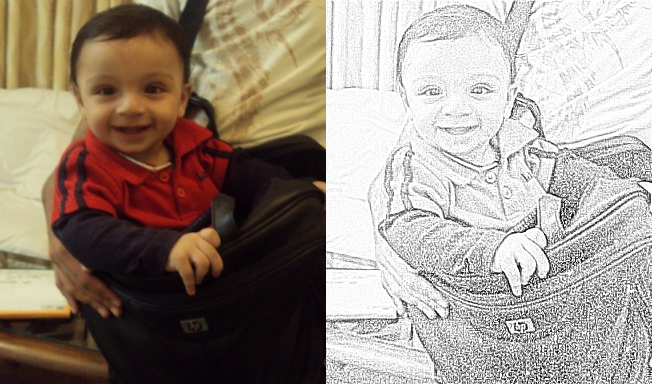

**Project Description**

This project contains a filter for blending one image over an other using effects like Color Dodge, Lighten, Darken, Difference, etc. And an example of how to use that to do a Pencil Sketch effect in C# using AForge framework

